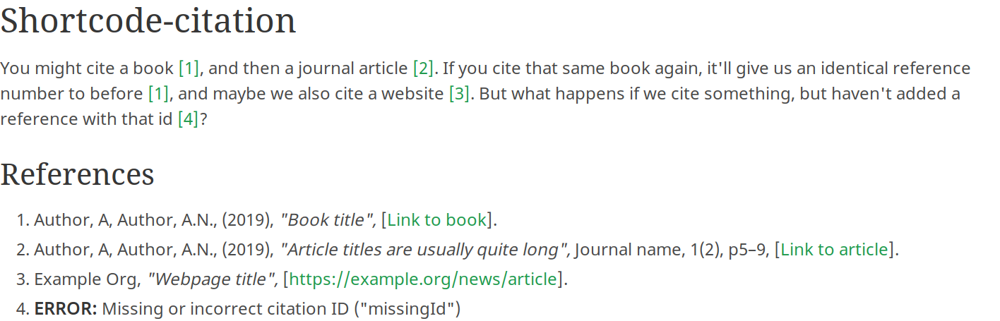

# Grav Shortcode Citation Plugin

This plugin for [Grav](https://getgrav.org) adds the ability to insert citations into pages via shortcodes (eg. `[cite=id /]`).

## Example output



## Installation

Typically a plugin should be installed via [GPM](http://learn.getgrav.org/advanced/grav-gpm) (Grav Package Manager):

```sh
bin/gpm install shortcode-citation
```

Alternatively it can be installed via the [Admin Plugin](http://learn.getgrav.org/admin-panel/plugins).


## Usage

### Adding references

The plugin adds a References section to pages inheriting the "default" blueprint. The references are stored per-page and by default only those that are cited in the page will be listed in the reference section. The order of the references in the list doesn't matter; they will always print in the order that they are cited in the text. The id entered **must** be unique.

This plugin is mostly to make citations easier, so the reference printing logic is currently quite simplistic; text is mostly printed as-is. This means that you are responsible for consistency of things like the format of author names, but also adds some flexibility to bend the rules a little bit. If a field is left empty or is not considered relevant for that reference type, it will be ignored.

Each section of the reference is contained in a span with a class such as `tax-author`, so it's pretty easy to format your reference section via CSS.

### Inserting citations

Citations are inserted via a shortcode in the form `[cite=id /]`, and will be printed as `[n]` in the text, with it being hyperlinked to the relevant entry in the references. Repeated citations of the same source will print the same number and link.

### Printing the reference list

The reference list can be printed either by adding `[cite /]` with no key id, or by including the `partials/citations.html.twig` template in your page template.

The heading for the reference section defaults to "References", but can be set in the plugin config via `heading_text` or as an option in the shortcode used to print it (eg. `[cite heading=Bibliography /]`). The title can also be disabled by setting the heading text to "false" via the same methods.

#### Configuring the reference list via shortcode:

Configuration options set in the shortcode override those in the plugin config and page header.

- "heading": (text) Sets the text of the heading. Can be set to "false" or "0" to disable it.
- "items": ("cited", "all", "uncited") Determines the works to include in the reference list.
- "reorder": (bool) Whether to reorder uncited works alphabetically (by ID). Set this to "false" or "0" to disable reordering and list uncited works in the order defined in the page header.

#### Configuring the reference list via plugin/page config:

All of these options can be set in the plugin config to affect the whole site, or on a page-level via the "Option" tab (or as entries under `shortcode_citation` in the page header).

- "heading_text": (text) Sets the text of the heading. Can be set to "false" to disable it.
- "items": ("cited", "all", "uncited") Determines the works to include in the reference list.
- "reorder_uncited": (bool) Whether to reorder uncited works alphabetically (by ID). Set this to "false" to disable reordering and list uncited works in the order defined in the page header.


## Integration into Twig templates

The citation manager is made available in Twig via the `citations` variable. To get an ordered array of citations, simply call `citations.getCitations()`.

### Using citations in a blog

When using citations in a blog there are a couple of extra methods that are useful. The first manually resets the citation list, so that the citation numbers start counting from 1 for each post on the page, rather than just increasing throughout the parent page. The second sets the url to prepend to the anchor links used by citations so that the links still work on the listing page; this is only needed in the blog list item template, so that the links on the child page are still just to the ID.

- `citations.reset()`: Resets the citations list and anchor URL.
- `citations.setUrl()`: Sets the URL to prepend to the anchor link.

Perhaps the easiest way to use these methods is to add the following snippet to the start of your blog list item template. (**Note:** `reset` should be performed before `setUrl`, since the former resets the latter).

```twig


```


## Customisation and extension

I welcome PRs for internationalisation and addition of new citation types.

However, if you prefer to create new citations types locally, you can extend the plugin without needing to fork it by following the instructions below.

### Adding reference types

You can add to the list of reference types by creating your own `blueprints/default.yaml` that adds to the list of options, using the blueprint below as a template.

```yaml
'@extends':
  type: default
  context: blueprints://pages

form:
  fields:
    tabs:
      type: tabs
      active: 1
      fields:
        content:
          fields:
            references:
              fields:
                header.references:
                  fields:
                    .type:
                      options:
                        new_key_name: 'Name for the new citation type'
                        another_key: 'Another citation type'
```

### Formatting new reference types

References are formatted via Twig templates, based on the name of the key for the reference type. For the above blueprint, these files would be called `new_key_name.html.twig` and `another_key.html.twig`, and saved at `partials/citations/`.


## Related projects

If this plugin doesn't fit your needs, try one of these other plugins:

- [bibliography](https://github.com/OleVik/grav-plugin-bibliography)
- [biblatex](https://github.com/OleVik/grav-plugin-biblatex)


## License

This plugin is licensed under the permissive [MIT License](LICENSE).
